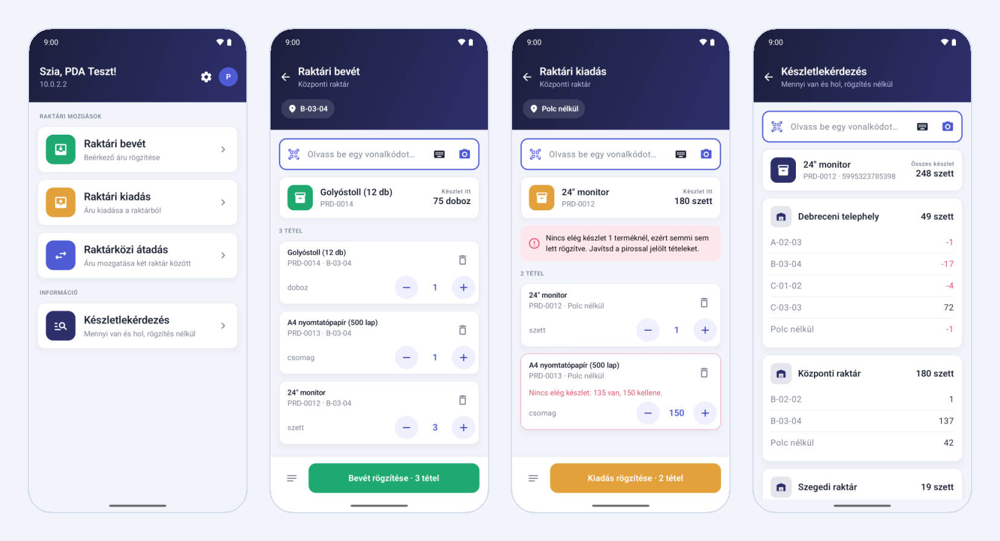
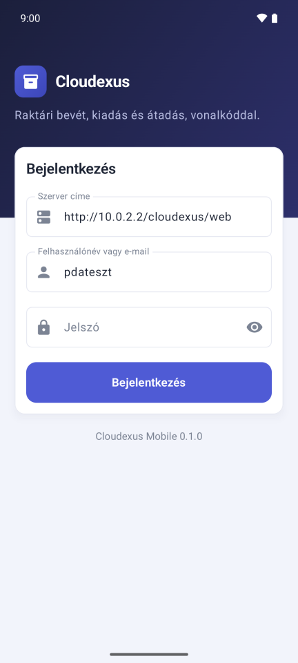
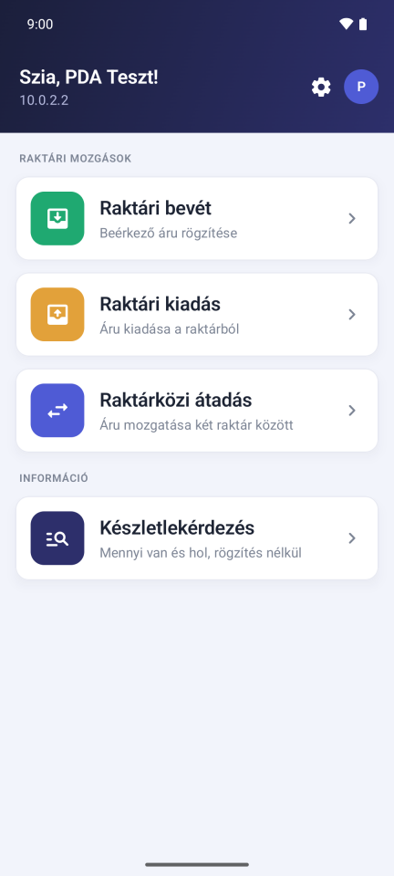
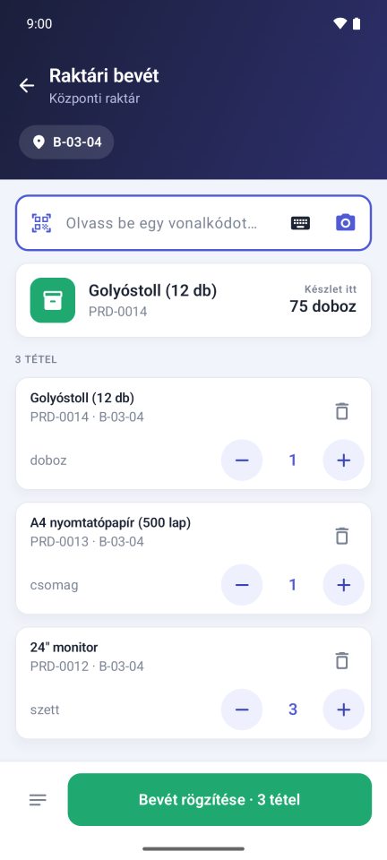
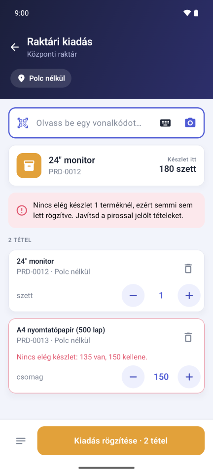
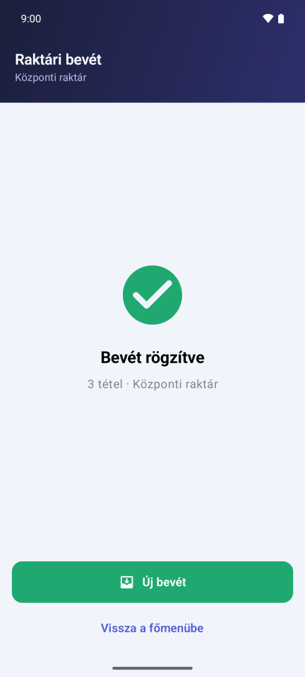
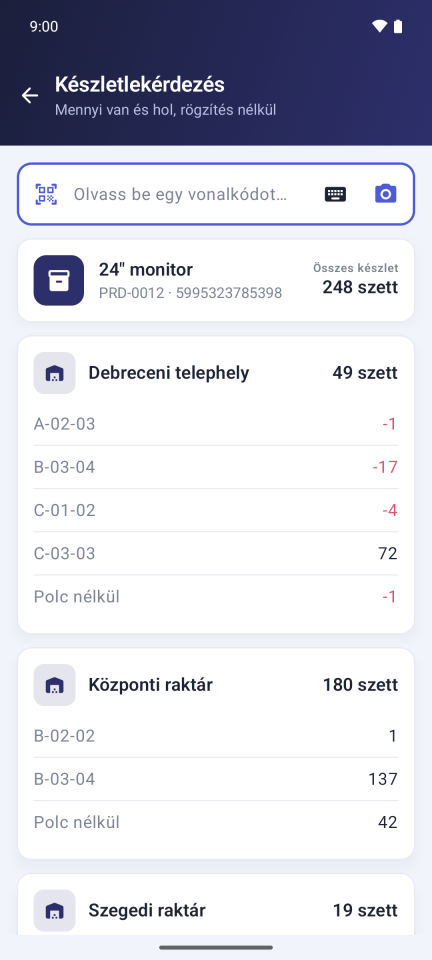

# 📦 Cloudexus Mobile

**Raktári bevét, kiadás és raktárközi átadás vonalkóddal, telefonon vagy PDA-n.**

A [Cloudexus](https://github.com/szabolevi98/cloudexus) ügyviteli rendszer Android appja
raktárosoknak. A webes felület a könyvelőé és a vezetőé; a raktárban viszont kézi vonalkódolvasó
van, és nem böngésző. Az app a Cloudexus REST API-ján keresztül dolgozik: a raktáros a saját
felhasználónevével lép be, beolvassa a polcot és az árut, és egy gombnyomással rögzíti. A mozgás
azonnal megjelenik a webes felületen, az ő nevére könyvelve.




---

## ✨ Mit tud

### 🏭 Raktári mozgások
- **Bevét, kiadás, raktárközi átadás**: raktár (átadásnál forrás- és célraktár) kiválasztása,
  aztán a tételek beolvasása és rögzítés. Egy rögzítés akárhány tételt vihet, és vagy mind
  lekönyvelődik, vagy egyik sem.
- **Polccímkék**: a beolvasott polckód átállítja a helyet a következő tételekre. Így a raktáros
  egyszerűen végigmegy a polcokon: polc, áru, áru, következő polc… A polc listából is választható.
- **Ismételt beolvasás**: ugyanaz a termék ugyanazon a polcon újra beolvasva eggyel növeli a
  mennyiséget. Pontos (akár tört) mennyiség a számra koppintva írható be.
- **Készlet a beolvasáskor**: minden beolvasásnál látszik, mennyi van a termékből az adott
  raktárban. Kiadásnál és átadásnál az app még küldés előtt szól, ha a lista többet kér, mint
  amennyi van.
- **Hibák a helyükön**: ha a szerver elutasítja a rögzítést (például készlethiány miatt), az
  indoklás annál a tételnél jelenik meg, amelyikre vonatkozik („135 van, 150 kellene”).

### 📶 Gyenge wifire tervezve
A raktár végében gyakran akadozik a wifi. Ha a rögzítés elmegy, de a válasz nem jön vissza, a
raktáros nem tudhatja, lekönyvelődött-e. Ezért az app minden rögzítést egy
[`Idempotency-Key`](https://github.com/szabolevi98/cloudexus/blob/main/web/API.md#idempotency-key-safe-retries)
kulccsal küld:
- válasz nélküli küldés után a lista zárolódik, és egyetlen gomb marad: **Újraküldés**;
- az újraküldés ugyanazzal a kulccsal megy, így a szerver a már lekönyvelt rögzítést nem
  könyveli újra, hanem visszaadja az első választ;
- két PDA-ról egyszerre indított kiadás sem viheti el ugyanazt az utolsó darabot, mert a
  szerver raktáranként sorba rendezi a rögzítéseket.

### 🔎 Készletlekérdezés
Bármi beolvasható rögzítés nélkül is: az app megmutatja, melyik raktárban és melyik polcon mennyi
van belőle. A negatív készletű polcok pirossal jelennek meg (ilyenkor a polcról többet adtak ki,
mint amennyit oda bevételeztek).

### 🔫 Vonalkódolvasók
| Mód | Mire jó | Beállítás |
|---|---|---|
| **Billentyűzet-emuláció** | Szinte minden PDA tudja: beírja a kódot és Entert nyom | Nem kell |
| **Broadcast intent** | Akkor is működik, ha nincs kijelölve a beolvasó mező | Beállítások → Vonalkódolvasó |
| **Kamera** | Beépített olvasó nélküli telefonon | A kamera gomb a beolvasó mezőben |

Broadcast intenthez előre beállított típusok: **Zebra** (DataWedge), **Honeywell**, **Urovo**,
**Newland**, **Sunmi**, **iData**, egyedi action és extra kulccsal pedig bármi más. A Beállítások
oldalon egy tesztmezőben rögtön kipróbálható, megérkezik-e a kód.

> **Zebra DataWedge:** a profilban kapcsold be az *Intent output*-ot, az action legyen
> `net.levente.cloudexus.mobile.SCAN`, a kézbesítés módja pedig *Broadcast intent*.

A beolvasó mező nem hagyományos szövegmező, ezért a képernyő-billentyűzet nem ugrik fel minden
beolvasásnál, és az olvasó Entere sem vész el a billentyűzetben. Kézi beíráshoz a billentyűzet
ikonnal lehet átváltani. A kamerás olvasás az ML Kit beépített modelljével megy, ezért Google
Play-szolgáltatás nélküli PDA-n is működik (EAN, UPC, Code 128, QR és a többi elterjedt formátum).

### 🔐 Biztonság
- Mindenki a **saját Cloudexus-fiókjával** lép be. A token a szerveren csak hash-ként van tárolva,
  a telefonon pedig az Android Keystore kulcsával titkosítva, ami az eszközt nem hagyja el. Az
  app adatai nem kerülnek biztonsági mentésbe.
- A token 90 nap használaton kívüli idő után jár le. Deaktivált felhasználónál vagy
  jelszóváltás után azonnal érvénytelen, és ilyenkor az app a belépési képernyőre küld.
- Az app a Cloudexus **szerepkörét** követi: akinek a szerepköre nem könyvelhet készletmozgást,
  annak a bevét, kiadás és átadás helyett egy magyarázat jelenik meg (a készletlekérdezés marad).
  A jogot mindig a szerver ellenőrzi; egy a weben átállított szerepkör az első elutasított
  kérés után az appban is látszik.
- A kiadott (release) verzió csak HTTPS-en kommunikál. Titkosítatlan HTTP csak a debug buildben
  engedélyezett, az emulátorból elérhető helyi szerverhez (`10.0.2.2`).

### 🌐 Nyelvek
Magyar és angol, a telefon nyelve szerint. Android 13-tól az app nyelve a rendszerbeállításokban
külön is választható. A terméknevek is ezen a nyelven jönnek, ha a Cloudexus-telepítésben van
ilyen fordítás.

---

## 📸 Képernyők

| Belépés | Főmenü | Bevét beolvasás közben |
|---|---|---|
|  |  |  |

| Kiadás készlethiánnyal | Rögzítve | Készletlekérdezés |
|---|---|---|
|  |  |  |

---

## 🚀 Telepítés

1. Töltsd le a legfrissebb `cloudexus-mobile-*.apk` fájlt a
   [Releases](https://github.com/szabolevi98/cloudexus-mobile/releases) oldalról.
2. Telepítsd a telefonra vagy a PDA-ra. Az első telepítésnél az Android engedélyt kér az
   ismeretlen forrásból származó alkalmazásokhoz.
3. Indításkor add meg a Cloudexus szerver címét (pl. `cloudexus.example.com`), a
   felhasználóneved és a jelszavad.

**Követelmények:**
- **Android 8.0 (API 26)** vagy újabb.
- Olyan Cloudexus-szerver, amelyen már vannak a mobil végpontok (`/api/auth/*`,
  `/api/products/lookup`, `/api/stock/in|out|transfer`), vagyis a
  [2026. szeptember 22-i](https://github.com/szabolevi98/cloudexus/commits/main) vagy újabb verzió,
  lefuttatott `php database/migrate.php`-vel.

## 🛠️ Fejlesztés

| Réteg | Megoldás |
|---|---|
| Nyelv, UI | Kotlin 2.4, Jetpack Compose, Material 3 a webes Cloudexus színeivel |
| Hálózat | OkHttp 5 + kotlinx.serialization |
| Tárolás | DataStore; a token Android Keystore AES-GCM kulccsal titkosítva |
| Kamera | CameraX + ML Kit Barcode Scanning (beépített modell) |
| Build | Gradle 9.7, Android Gradle Plugin 9.4, compileSdk 37, minSdk 26 |

```bash
# Debug build a helyi szerverhez (emulátorból: http://10.0.2.2/cloudexus/web)
./gradlew assembleDebug

# Unit tesztek (a könyvelési lista logikája és az API-kliens egy mock szerver ellen)
./gradlew testDebugUnitTest

# Debug build R8-cal, pontosan úgy minifikálva, mint a release, de a helyi szerverhez.
# Kiadás előtt ezzel érdemes kipróbálni a kamerát: az ML Kit reflexiója csak minifikálva törik el.
./gradlew assembleDebug -PminifyDebug
```

Aláírt release buildhez a projekt gyökerébe kell egy `keystore.properties` (Git által ignorált):

```properties
storeFile=C:/path/to/release.jks
storePassword=...
keyAlias=cloudexus-mobile
keyPassword=...
```

Nélküle a `./gradlew assembleRelease` aláíratlan APK-t készít.

### Projektstruktúra

```
app/src/main/java/net/levente/cloudexus/mobile/
├── data/
│   ├── api/        # ApiClient (a Cloudexus REST API), modellek, hibatípusok
│   ├── session/    # bejelentkezés, titkosított token, lejárat kezelése
│   └── scanner/    # PDA-típusok (broadcast intent) és a beolvasás fogadása
└── ui/
    ├── booking/    # bevét / kiadás / átadás: a lista logikája (Draft) és a képernyő
    ├── lookup/     # készletlekérdezés
    ├── login/, home/, settings/, scan/ (kamera)
    ├── components/ # közös elemek: fejléc, kártya, beolvasó mező, mennyiségléptető
    └── theme/      # a webes Cloudexus design tokenjei
```

A teljes API-leírás a Cloudexus repóban van: [web/API.md](https://github.com/szabolevi98/cloudexus/blob/main/web/API.md).

## 📄 Licenc

[GNU AGPLv3](LICENSE), ugyanúgy, mint a Cloudexus. © 2026 [szabolevi98](https://github.com/szabolevi98)
